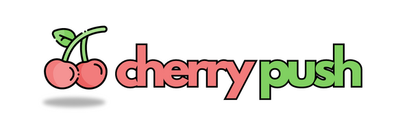

<br />
<p align="center">
  <a href="https://cherrypush.com/" target="_blank">
    
  </a>
</p>
<br />

<p align="center">
Cherry is an open-source code static analysis tool. It allows you to stay on top of your technical debt, capture the value of your work, and recognize your top team members.
</p>

<p align="center">
<a href="https://github.com/cherrypush/cherrypush.com/stargazers"></a>
</a>
<a href="https://github.com/cherrypush/cherrypush.com/pulse"></a>
<!-- <a href="https://docs.typebot.io/self-hosting/docker">

</a> -->
<a href="https://github.com/cherrypush/cherrypush.com/blob/main/LICENSE">
<a href="https://github.com/cherrypush/cherrypush.com/issues/new"></a>
<!-- <a href="https://github.com/cherrypush/cherrypush.com/discussions/new?category=q-a"></a> -->
</p>

<h3 align="center">
  <b><a href="https://cherrypush.com/docs">docs</a></b>
  •
  <b><a href="https://www.npmjs.com/package/cherrypush">npm package</a></b>
  •
  <b><a href="https://twitter.com/intent/user?screen_name=fwuensche">twitter</a></b>
</h3>

<br />

## Getting started

```sh
# clone the project
git clone git@github.com:cherrypush/cherry.git
cd cherry

# install dependencies
bundle install
npm install

# setup database
docker compose up -d
rails db:setup

# setup local env vars
cp .rbenv-vars.template .rbenv-vars

# launch the server
bin/dev
```

> The env vars step above assumes you're using the rbenv-vars plugin. If you don't have it installed, check their docs
> [here](https://github.com/rbenv/rbenv-vars) or use an alternative method to load your environment variables.

## Running in production

You can either use Heroku or the `fwuensche/cherry` image from Docker Hub.

Note that, in both cases, you'll also need a running instance of Postgres and Redis.

<!-- TODO: update this command to reflect all recent changes to our infra
```
docker run \
  -e SECRET_KEY_BASE=<secret> \
  -e DATABASE_URL=postgresql://<user>:<pass>@<host>:5432/<db_name> \
  cherrypush/cherry
``` -->

## Contributing

In addition to the above-mentioned docs, a good way to get started contributing is to watch some of the live sessions
below. This should give you insights on how to navigate the codebase and help you with your first few steps.

Cherry CLI (JavaScript):

- Add support for array of globs: https://youtu.be/zPrVUFDcQ5Y
- Sort results of cherry run: https://youtu.be/ZjJqDBLbM-E

Cherry App (Ruby on Rails):

- Add a new API endpoint + controller tests: https://youtu.be/vh1bCTe16Bs
- Fixing N+1 queries on metrics#index: https://youtu.be/isqa9r0SpsA
- Fixing N+1 queries on dashboards#index: https://youtu.be/vcGpfbLuliA

Huge thanks to our contributors 🙏

<a href="https://github.com/cherrypush/cherrypush.com/graphs/contributors">
  
</a>

## Any further question or suggestion?

[Shoot me a message on Twitter](https://twitter.com/messages/compose?recipient_id=38940653) 🤠
