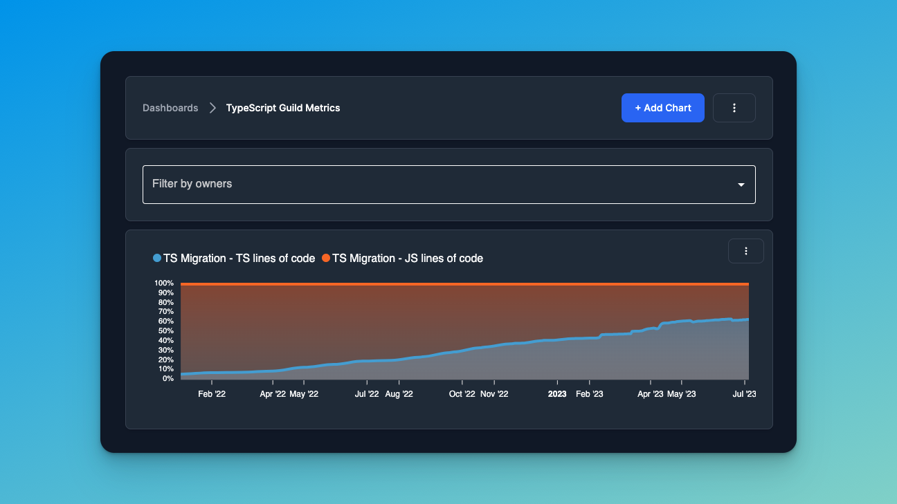

# Wage war against your technical debt in a single commit

Hello there. I’m Flavio from Cherry, and I’m going to show you how you can wage war against your technical debt in a
single commit. (wow such a badass intro) 😎

## 1. Create your free account

First, head right up here and click **_Login with GitHub_**:

You'll be prompted with a GitHub OAuth page. Make sure you read and understand the information we're asking access to.
If you agree, then accept :)

## 2. Set up your project

The next thing for us to do is to set up our first project.

If this is your first time here, you should see something like the below, with very clear step-by-step copy-and-paste
ready-to-use command-line commands that will get you started in about a couple of minutes:

Note that they're all ready to copy & paste into your terminal, even with your real api key in it. Just go ahead, copy
and paste each of one these commands into your terminal. Ofc, you need to be inside your project folder 🙃

Well, technically you're good to go. It's all set. But let's guide you through a little of the core feature that might
be of your interest.

## 3. Create a dashboard (optional)

Now, one of the main things about Cherry is that you can get up and running in a sec, but you can also slowly customize
your config file to track the most important metrics for you.

Out-of-the-box, you’ll get things such as the **count of lines of code per programming language**, which gets
automatically tracked via one of the many plugins that we offer.

This is perfect, for instance, if you're migrating your codebase from JavaScript to TypeScript, so you can build your
own percentage charts and keep track of how your migration evolves over time.

Of course, darling, from day one you won't have this beautiful hockey stick chart. It'll be up to you to work with your
team, and make the metrics move in the right direction. The great thing is that, once you do it, Cherry will be there to
**capture the value of your work** and allow you and your team to show off your achievements.

---

Now back to our Cherry Dashboard, I can…

- open my project and get a list of all its metrics

Inside each metric, I can see:

- how it evolved over time
- who's been actively contributing to it
- and even who were our top contributors

This is the perfect tool for technical leaders such as Engineer Manager or Staff Engineers

so they can easily capture the value of their work

and, more importantly, recognize the work of their top team members.

---

Finally, if you're tracking critical metrics, such as known security issues

I advise you to WATCH changes to your metric.

Cherry will keep you updated whenever new occurrences are found,

and send you a notification both: inside the app, and via email.

---

You're now in full control of your technical debt!

And you don't even need to go to GitHub for that.

---

And this is how you wage war against your technical debt, with a single commit!
