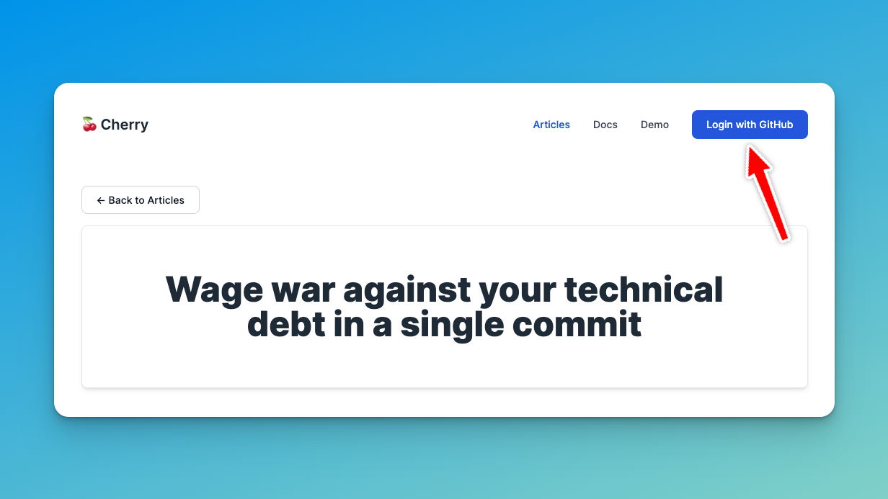
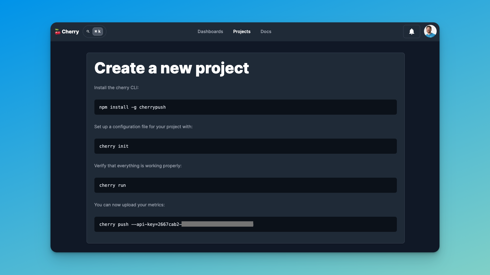
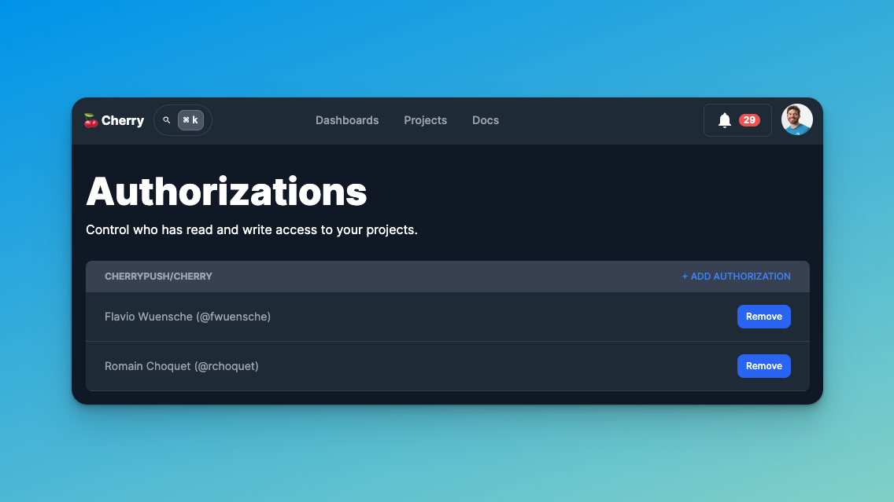

# Getting Started with Cherry

Hello there. I’m Flavio from Cherry, and I’m going to show you how you can wage war against your technical debt, in a
single commit. (wow such a badass intro) 😎

## 1. Sign up with GitHub

First off, let's go ahead and create a free account for you:

You'll be prompted with a GitHub OAuth page. If you'd like to see exactly how we use your personal information, you can
check it out
[here](https://github.com/cherrypush/cherry/blob/aa754662a7b232a229b2607439457283a9aab3c0/app/models/user.rb#L48-L58).
If you agree, then accept it :)

## 2. Set up your first project

Now you're logged in! Since it's your first time here, you'll be redirected to the
[onboarding page](https://www.cherrypush.com/user/projects/new) below. There you'll find a very clear step-by-step guide
with ready-to-use CLI commands to get you up and running in just about a minute:

Note that they're all ready to copy & paste into your terminal. It also contains your real API key. We've made
everything to smoothen your onboarding experience.

And that's it! You're good to go. ⚡️

---

As a side note, if you look inside your commit, you'll see that we're adding two files:

- a configuration file -> .cherry.js
- and a workflow file -> .github/workflows/cherry_push.yml

The **configuration file** is where you can set up new patterns. The things that you want to track. These are going to
be used to scan your codebase, and submit the metrics to our servers, so you can compose your dashboards later on.

As for the **workflow file**, it's actually a **GitHub Action** that'll be run for every commit on your main branch. For
each run, it'll use the config file to scan your codebase, track your metrics, and report the contributions from the
current commit.

Put together, they completely automate the work of tracking your technical debt!

## 3. Create a dashboard (optional)

Now, one of the main things about Cherry is that you can get up and running in a sec, but you can also slowly customize
your config file to track the most important metrics for you.

Out-of-the-box, you’ll get things such as the **count of lines of code per programming language**, which gets
automatically tracked via one of the many plugins that we offer.

This is perfect, for instance, if you're migrating your codebase from JavaScript to TypeScript, so you can build your
own percentage charts and keep track of how your migration evolves over time.

Of course, darling, from day one you won't have this beautiful hockey stick chart. It'll be up to you to work with your
team to make the metrics move in the right direction. The great thing is, while you do it, Cherry will be there to
**capture the value of your work** and support you and your team to **show off your achievements**.

> NOTE: This section would be better off in a separate article and replaced here with instructions on how to backfill
> data, and we already have a `cherry backfill` command. Feel free to suggest changes
> [here](https://github.com/cherrypush/cherry/blob/aa754662a7b232a229b2607439457283a9aab3c0/public/articles/the-one-commit-against-technical-debt.md#L64).

## 4. Share access with your team

I'm sure you're feeling motivated already. All pumped up. Ready to start contributing and make your charts look great.
But you'll probably be better off with some help from your team.

So let's go to the [Authorizations page](https://www.cherrypush.com/user/authorizations) and start sharing access with
your team.

> NOTE: We currently only allow you to add other already created users. It'd be a great feature to actually allow people
> to submit an invitation to an email and allow the invited person to sign up and access the project. The project is
> open-source and looking for contributors, so feel free to submit your PR :) https://github.com/cherrypush/cherry

## Next steps

Now, one of the main things about Cherry is that you can get up and running in a sec, but you can also slowly customize
it to track what's most important for you.

Here's a non-exhaustive list of things that you might want to do next:

- Backfill your project data with historic data (<- TODO: write an article and link it here)
- Create your first dashboard (<- TODO: write an article and link it here)
- Recognize your Top Contributors 🏆 (<- TODO: write an article and link it here)
- Watch changes to critical metrics (<- TODO: write an article and link it here)
- Block PRs introducing new violations (<- TODO: write an article and link it here)
- Activate plugins such as rubocop or eslint (<- TODO: write an article and link it here)
- Create custom integrations via the Cherry API (<- TODO: write an article and link it here)
